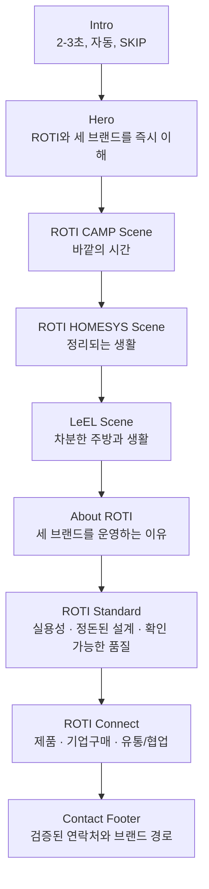

# ROTI Homepage Renewal Structure V1

> Status: Proposed implementation baseline  
> Authority: `Design.md`  
> Purpose: 현재 홈페이지를 여러 시안의 결합체가 아닌 하나의 ROTI 브랜드 포털 경험으로 압축한다.

## 1. Renewal Decision

현재 가장 완성도가 높은 **Intro → Hero → 세 브랜드 장면**의 어두운 시네마틱 언어를 전체 기준으로 삼는다.

- 페이지의 약 80%는 black / charcoal / dark premium 톤을 유지한다.
- `ROTI Connect`만 warm off-white로 전환해 마지막 행동 구간을 명확히 구분한다.
- Ember Red `#B41307`은 활성선, 포커스, 짧은 강조 문장에만 사용한다.
- 페이지 전체에서 강한 pinned / snap motion은 브랜드 장면 스택 한 곳에만 둔다.
- Hero 카드 클릭은 카드 선택과 중앙 정렬에서 끝난다. 브랜드 장면 진입은 정상 스크롤 또는 명시적 내비게이션으로 처리한다.
- 사용자에게 같은 세 브랜드 설명을 Hero, 브랜드 장면, About에서 반복하지 않는다.

## 2. Final Page Flow

스크롤 기준으로는 Hero 1화면 + 브랜드 3화면 + 정보 3구간 + Footer로 구성한다. 현재처럼 About 4장면, Standard 3장면, 별도 Stats/Channels, 대형 Contact 화면을 연속해서 쌓지 않는다.

## 3. Keep / Merge / Remove / Redesign

| Current area | Decision | Renewal role |
|---|---|---|
| `IntroSequence` | KEEP + POLISH | 2-3초 자동 재생, 1회/세션, Hero 카드 펼침으로 자연스럽게 연결 |
| `Header` | KEEP + POLISH | Hero에서는 낮은 대비, 스크롤 후 상단 내비게이션으로 전환 |
| `HeroPortal` | KEEP + REDESIGN | 배경과 카드 이미지의 중복을 줄이고 카드 오브젝트를 주인공으로 강화 |
| `BrandTransitionProvider` | REMOVE FROM HERO FLOW | 현재 `Design.md`에 따라 카드 클릭 기반 fullscreen 전환과 자동 스크롤 제거 |
| `BrandSlideStack` | KEEP + POLISH | 홈페이지의 대표 몰입 구간. 한 화면에 한 브랜드만 명확히 노출 |
| `AboutRotiSection` | MERGE + REBUILD | 4개 pinned 장면을 1개 그룹 설명 화면으로 압축 |
| `RotiStatsSection` | REMOVE | 숫자 중심 기업 홍보 문법과 검증 부담 제거. 꼭 필요한 검증 수치만 추후 About 보조 정보로 제한 |
| `RotiChannelsSection` | REMOVE / FOOTER MERGE | 판매 채널 나열을 본문에서 제거. 승인·검증된 외부 링크만 Footer 또는 브랜드 CTA로 이동 |
| `RotiBusinessReplicaSection` | REBUILD | 3개 horizontal pinned 화면을 1개 Standard 화면으로 압축 |
| `RotiConnectSection` | KEEP + SIMPLIFY | warm off-white 행동 구간. 문의 유형 3개와 검증된 연락처 연결 |
| `ContactUsSection` | MERGE | 대형 입력 폼을 제거하고 Connect + Footer의 간결한 연락 정보로 통합 |
| `Footer` | KEEP + POLISH | 회사 정보, 대표 연락처, 세 브랜드 경로, 정책 링크 정리 |

## 4. Section Blueprint

### 4.1 Intro

**Goal**  
ROTI 로고를 기억시키고 Hero의 카드 무대로 자연스럽게 진입시킨다.

**Keep**

- 자동 재생
- 약 2-3초
- `SKIP`
- 세션당 한 번

**Remove**

- 사용자 입력을 기다리는 수동 단계
- 긴 블랙 프레임
- Hero와 무관한 독립 영상처럼 보이는 마무리

### 4.2 Hero

**Goal**  
10초 안에 ROTI가 세 브랜드를 운영하는 그룹이라는 사실을 이해하게 한다.

**Composition**

- Top: ROTI logo / menu
- Center-top: 현재 Hero 문장과 짧은 설명
- Center: 3D glass brand card stage
- Side: restrained arrows + small brand index
- Bottom-right desktop only: low-contrast primary navigation

**Interaction**

- 화살표: 활성 카드만 변경
- 측면 카드 클릭: 중앙으로 이동
- 중앙 카드 클릭: 상태와 스크롤 유지
- 브랜드 장면: 정상 스크롤 또는 `BRAND` 내비게이션으로 진입

**Visual correction**

- 배경은 특정 브랜드 제품 사진보다 smoke / mist / soft spotlight 중심의 공통 ROTI 무대로 변경
- 카드 안에서만 각 브랜드의 대표 장면을 명확히 보여 배경과 카드의 이미지 중복을 제거
- 카드 접지 그림자는 black / gray로 유지하고 빨간 바닥광은 사용하지 않음

### 4.3 Brand Scene Stack

**Goal**  
세 브랜드의 차이를 가장 강하게 기억시키는 유일한 몰입형 스크롤 구간으로 사용한다.

**Shared layout**

- Full-bleed image
- Lower-centered logo, 한 문장 정의, 3개 키워드
- 검증된 목적지가 있을 때만 CTA 노출
- 동일한 인덱스, 동일한 카피 위치, 동일한 전환 속도

**Brand variation**

| Brand | Scene mood | Color temperature | Main subject |
|---|---|---|---|
| ROTI CAMP | dark outdoor / mountain / rest | neutral-warm dusk | 캠핑 장면과 이동성 |
| ROTI HOMESYS | organized interior / utility | warm charcoal | 수납 구조와 생활 동선 |
| LeEL | kitchen / steel / stone / negative space | calm warm-gray | 소재와 정돈된 생활 오브젝트 |

**Motion budget**

- Desktop: full-bleed scene → restrained lifted card transition
- Mobile: 안정적인 2D fade/slide 또는 정적 100svh 장면
- 다른 정보 섹션에는 동일한 pinned 효과를 반복하지 않음

### 4.4 About ROTI

**Goal**  
브랜드 목록을 다시 소개하지 않고, ROTI가 왜 세 브랜드를 운영하는지 설명한다.

**One-screen structure**

- Eyebrow: `ABOUT ROTI`
- H2: 현재에 머물지 않고, 변화하는 생활을 읽습니다.
- Direct explanation: 캠핑·홈리빙·키친을 서로 다른 브랜드로 운영하며 생활의 불편을 쓰임 중심으로 정리한다는 설명
- One simple relationship row: `바깥 / 집 / 주방과 생활`
- No 01-04 pinned scenes
- No repeated full-screen brand images

### 4.5 ROTI Standard

**Goal**  
추상적인 프리미엄 표현 대신 ROTI가 제품을 바라보는 기준을 명확히 보여준다.

**One-screen structure**

1. Practicality — 필요한 기능은 분명하게
2. Ordered Design — 생활의 흐름은 더 단정하게
3. Verifiable Quality — 보이는 구조와 마감으로 확인되게

**Desktop**  
한 화면 안에서 3개 기준을 순차적으로 읽는 editorial grid로 구성한다.

**Mobile**  
세로 스택 또는 accordion을 사용하며 horizontal pinned scroll을 사용하지 않는다.

**Claims rule**  
인증, 공급, 수상, 판매 순위, 특허 수량 등은 근거가 확인된 경우에만 별도 근거와 함께 노출한다.

### 4.6 ROTI Connect

**Goal**  
사용자가 자신의 문의 유형과 다음 행동을 빠르게 선택하게 한다.

**Visual role**  
페이지에서 유일한 warm off-white 구간으로 사용해 행동 전환을 만든다.

**Three routes**

- 제품 및 구매 문의
- 기업·단체 구매 문의
- 유통·입점·협업 문의

**Interaction**

- 3개 tab + 하나의 active image + 간단한 설명
- 자동 전환은 필요한 경우 5초 이상, hover/focus 시 정지
- reduced-motion에서는 자동 전환 정지
- 새 대형 문의 폼을 만들지 않고 검증된 전화, 이메일 또는 승인된 외부 문의 경로로 연결

### 4.7 Contact Footer

**Goal**  
마지막 화면에서 회사 신뢰 정보와 브랜드 이동 경로를 간결하게 마무리한다.

**Include**

- 대표전화 / 이메일 / 주소
- 사업자 정보
- ROTI CAMP / ROTI HOMESYS / LeEL 링크
- 이용약관 / 개인정보처리방침

**Remove**

- 별도 100vh `CONTACT US` Hero
- 목적이 불분명한 입력 폼
- 승인되지 않은 판매 채널 및 외부 브랜드명

## 5. One Visual System

### Color

- 80%: `#050505`, `#0B0B0B`, `#111111`
- 15%: white / soft gray / one warm off-white Connect surface
- 5% 이하: Ember Red `#B41307`

### Typography

- Korean: Pretendard or SUIT
- English/UI: Inter
- Desktop body: 16-20px
- Mobile body: minimum 16px
- Section H2: desktop 48-64px, mobile 32-42px
- 작은 대문자 label은 보조 정보에만 사용하고 본문 역할을 맡기지 않음

### Grid

- Body sections: `--section-content-max: 95rem`
- Shared responsive gutter
- About / Standard / Connect / Footer의 핵심 콘텐츠 왼쪽 축 통일
- Full-bleed 구간에서도 카피와 CTA는 같은 body grid에 맞춤

### Image Direction

- 실제 ROTI 제품과 생활 장면을 우선 사용
- 전체 이미지를 warm charcoal / muted amber / restrained red 계열로 통일
- 밝은 3D 통계 아이콘, 일반적인 기업 회의 스톡 이미지, 서로 다른 렌더링 스타일을 혼용하지 않음
- 브랜드별 차이는 피사체와 공간으로 만들고, 전체 색보정과 대비 체계는 공유

### Motion

- Intro: 2-3s, once per session
- Hero card change: approximately 400-600ms
- Brand scene transition: 주요 scroll motion 한 곳
- Information reveal: approximately 250-450ms fade/slide
- No additional long horizontal pinning
- No competing wheel ownership

## 6. Desktop / Mobile Structure

| Area | Desktop | Mobile |
|---|---|---|
| Hero | 3D center + restrained side cards | active card 우선, side depth 축소 |
| Brand scenes | pinned visual stack | 2D-heavy 100svh scenes, frame stability 우선 |
| About | one-screen editorial composition | normal-flow content, snap 없음 |
| Standard | three-column or sequential grid | vertical stack / accordion |
| Connect | tabs + center image | readable stacked tabs/cards, 44px+ controls |
| Contact | compact footer ending | normal-flow footer, safe-area padding |

## 7. Implementation Order

### Phase 0 — Source-of-truth cleanup

- Hero center-card transition path 제거
- `BrandTransitionProvider` 및 관련 overlay의 실제 사용 범위 정리
- Hero ARIA 문구를 `브랜드 섹션으로 이동`에서 `메인 카드로 보기`로 수정

### Phase 1 — IA compression

- `RotiStatsSection` 본문 제거
- `RotiChannelsSection` 본문 제거
- `AboutRotiSection`을 한 화면으로 재구성
- `ContactUsSection`을 Connect/Footer로 통합

### Phase 2 — Unified visual system

- dark surface / type / spacing / grid 토큰 정리
- 이미지 색보정 방향 통일
- Standard를 한 화면 editorial grid로 변경

### Phase 3 — Motion and responsive

- Brand scene stack만 핵심 pinned motion으로 유지
- About / Standard / Connect의 추가 scroll-jacking 제거
- mobile 390px, tablet 768px, desktop 1440px 조정
- reduced-motion과 keyboard 상태 정리

### Phase 4 — Visual QA

- section boundary와 색 전환 확인
- body grid와 카피 축 확인
- 이미지 crop과 텍스트 대비 확인
- `pnpm lint`, `pnpm typecheck`, `pnpm build`

## 8. Definition of Success

- 첫 화면 10초 안에 ROTI와 세 브랜드의 관계를 이해할 수 있다.
- Hero와 브랜드 장면 이후 같은 세 브랜드 소개가 반복되지 않는다.
- 페이지 전체에서 강한 pinned scroll 경험은 브랜드 장면 스택 한 곳뿐이다.
- 의도적인 밝은 전환은 ROTI Connect 한 곳뿐이다.
- 모바일 본문이 16px 미만으로 내려가지 않는다.
- Hero 카드 클릭으로 fullscreen 전환, 자동 스크롤, scroll lock이 발생하지 않는다.
- 승인되지 않은 제3자 브랜드명이나 검증되지 않은 수치·주장을 노출하지 않는다.
- Intro, Hero, 브랜드 장면, 정보 섹션, Footer가 하나의 ROTI 디자인 시스템으로 보인다.

## 9. Scope Boundary

이번 구조안은 리뉴얼 구현 기준이며, 다음 기능은 포함하지 않는다.

- Cafe24 API
- 장바구니 / 결제 / 주문 / 회원가입
- 상품 목록형 쇼핑 UI
- 신규 브랜드 상세 페이지
- 신규 애니메이션 라이브러리
- 검증되지 않은 숫자, 인증, 파트너, 공급, 수상 주장

## 10. Document Conflicts Resolved

일부 `AGENTS.md`, handoff, harness 문서는 Hero 카드 클릭 후 fullscreen 브랜드 전환을 요구한다. 현재 권한 순서와 사용자의 명시적 결정에 따라 이 구조안은 최신 `Design.md`의 **카드 선택과 중앙 정렬만 수행하고 Hero에 머무르는 규칙**을 따른다.
