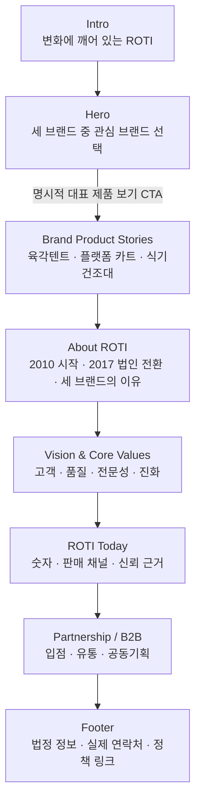

# ROTI Homepage Renewal Structure V2 — Content First

> Status: 사용자 최신 콘텐츠를 반영한 구현 전 구조안  
> Authority: 사용자 최신 요청 → `Design.md` → 현재 구현  
> Supersedes: `ROTI_HOMEPAGE_RENEWAL_STRUCTURE_V1.md`의 Stats/Channels 제거 제안  
> Scope: 중복 제거, 정보 구조, 카피 역할, 검증 상태, 기존 컴포넌트 재사용 판단

## 1. 결론

새 섹션을 계속 덧붙이지 않는다. 현재 홈페이지에 이미 있는 **Hero 3개 카드, 브랜드 3개 장면, Stats, Channels, Connect, Footer**를 살리고, 역할이 겹치는 **About / Standard / Contact**를 새 콘텐츠에 맞춰 교체·통합한다.

최종 흐름은 다음과 같다.

```text
Intro
→ Hero 브랜드 게이트웨이
→ 브랜드 대표 제품 3장면
→ About ROTI 회사 서사
→ Vision & Core Values
→ ROTI Today: 리드 + 숫자 + 채널 + 신뢰 정보
→ Partnership / B2B
→ Footer
```

핵심은 세 가지다.

1. Hero는 세 브랜드를 **선택하고 이해하는 곳**이다.
2. 브랜드 장면은 각 브랜드의 **대표 제품 하나를 구체적으로 설명하는 곳**이다.
3. About 이후는 같은 브랜드 소개를 반복하지 않고 **회사 연혁, 기준, 현재 규모, 신뢰 근거, 문의 행동**으로 전진한다.

## 2. 현재 구현과 사용자 콘텐츠 중복 대조

| 사용자 제안 | 현재 구현 | 판단 | V2 처리 |
|---|---|---|---|
| `Always alert for changes` | `AboutRotiSection` 첫 장면에 이미 있음 | 위치 중복 | About에서 빼고 Intro의 핵심 문장으로 이동 |
| 세 브랜드 카드 | `HeroPortal`에 3개 카드가 이미 있음 | 완전 중복 | 새 카드 섹션을 만들지 않고 Hero를 브랜드 게이트웨이로 사용 |
| ROTI CAMP 문장 | `brands.ts`에 동일 문장 있음 | 완전 중복 | 기존 데이터 재사용 |
| ROTI HOMESYS 문장 | `visualTagline`에 동일 문장, `headline`은 다른 문장 | 부분 중복 | 사용자 문장으로 대표 카피를 하나로 통일 |
| LeEL 문장 | `visualTagline`에 동일 문장, `headline`은 다른 문장 | 부분 중복 | 사용자 문장으로 대표 카피를 하나로 통일 |
| 육각텐트 | CAMP 카드/섹션 이미지에 육각 쉘터가 이미 표현됨 | 부분 구현 | 대표 제품 설명과 정확한 상품명·CTA 보강 |
| 플랫폼 카트 | HOMESYS 이미지와 alt에 이미 있음 | 부분 구현 | 대표 제품 설명과 정확한 상품명·CTA 보강 |
| 식기건조대 | 현재 LeEL 장면은 트롤리 중심 | 미구현 | 실제 식기건조대 이미지와 설명 필요 |
| 회사 연혁·2010·2017 | 현재 About은 그룹/브랜드 소개 반복 | 사실상 미구현 | 기존 About 전체를 회사 서사로 교체 |
| Vision | 없음 | 신규 | About 다음에 짧은 선언형 블록으로 추가 |
| 핵심 가치 4개 | 현재 Standard 3개와 일부 의미 중복 | 역할 중복 | Standard를 유지한 채 추가하지 않고 Core Values로 교체 |
| 2010 / 400+ / 40+ / 3 / 5 | `stats.ts`에 전부 동일하게 존재 | 완전 중복 | 기존 Stats 재사용, 숫자만 공식 자료 확인 후 확정 |
| 판매 채널 전체 | `RotiChannelsSection`에 목록이 동일하게 존재 | 완전 중복 | 기존 Channels 재사용, 최신 입점 여부와 링크만 재검증 |
| 물류·인증·지식재산 | 없음 | 신규 | 별도 풀스크린을 만들지 않고 `ROTI Today` 안의 신뢰 블록으로 추가 |
| 입점·제휴·B2B | `RotiConnectSection`에 이미 3개 문의 유형 존재 | 역할 중복 | 제목과 항목을 제휴 목적에 맞춰 수정 |
| 문의하기 | Connect CTA는 비활성, Contact 폼은 실제 전송 안 됨 | 기능 중복·미완성 | 두 섹션을 합치고 검증된 이메일/전화 CTA만 제공 |
| 법정 정보 Footer | 회사명, 대표, 사업자번호, 통신판매번호, 주소, 전화, 이메일이 이미 있음 | 대부분 구현 | 값 재검증 후 유지. `#`인 약관·카테고리 링크는 실제 링크로 교체 |

### 제거되는 가장 큰 중복

- Hero와 브랜드 장면 뒤에 다시 세 브랜드를 4개 pinned 장면으로 소개하는 현재 About
- Core Values와 별개로 유지될 경우 의미가 겹치는 현재 ROTI Standard
- 문의 유형을 고른 뒤 다시 나오는 전송 불가능한 대형 Contact 폼
- Stats와 Channels를 새 섹션으로 한 번 더 만드는 구조

## 3. 최종 IA

### 0. Intro — Brand Attitude

**노출 문장**

```text
ALWAYS ALERT FOR CHANGES
변화에 늘 깨어 있습니다.
```

**역할**

- ROTI의 태도를 2~3초 안에 각인한다.
- 로고 장면에서 Hero 카드 무대로 바로 연결한다.
- 현재 About에 있는 동일 문구는 제거한다.

**동작**

- 자동 재생, 세션당 1회, `SKIP` 유지
- reduced motion에서는 짧은 로고/문장 상태 후 즉시 Hero 진입

---

### 1. Hero — Three Brands, One ROTI

Hero가 곧 사용자 요청의 **카드형 브랜드 소개**다. 별도 Brand Portfolio 섹션은 만들지 않는다.

**상단 카피**

```text
ROTI
일상을 위한 세 가지 방식
```

**카드 카피**

| Brand | Main copy | Representative product |
|---|---|---|
| ROTI CAMP | 캠핑을 더 쉽게, 바깥의 시간을 더 편안하게. | 육각텐트 |
| ROTI HOMESYS | 생활을 더 편리하게, 하루를 더 가볍게. | 플랫폼 카트 |
| LeEL | 공간을 더 단정하게, 일상을 더 곱게. | 식기건조대 |

**클릭 규칙**

`Design.md`에 따라 카드 자체의 클릭은 다음처럼 처리한다.

- 측면 카드 클릭: 중앙 카드로 선택
- 중앙 카드 클릭: Hero에 그대로 머묾
- 카드 클릭만으로 자동 스크롤하거나 브랜드 장면으로 이동하지 않음

사용자의 `바로가기` 요구는 **활성 카드 옆의 명시적 CTA**로 해결한다.

```text
[대표 제품 보기]
```

- CTA를 누르면 해당 브랜드 대표 제품 장면으로 이동한다.
- 카드 선택과 페이지 이동을 한 요소에 섞지 않아 동작을 예측 가능하게 만든다.
- CTA는 카드 위의 작은 숨은 링크가 아니라 모바일에서도 44px 이상인 독립 버튼으로 제공한다.

---

### 2. Brand Product Stories — 브랜드당 대표 제품 하나

현재 `BrandSlideStack`을 유지하되, 추상적인 브랜드 무드 소개에서 **대표 제품 중심의 브랜드 설명**으로 선명하게 바꾼다.

#### 2.1 ROTI CAMP

```text
ROTI CAMP
캠핑을 더 쉽게, 바깥의 시간을 더 편안하게.

Representative Product
육각텐트

설치와 사용의 부담을 낮춰
처음 캠핑을 시작하는 사람도 바깥의 시간을 편안하게 즐길 수 있도록 합니다.

[ROTI CAMP 브랜드 상품 더보기]
```

- 현재 육각 쉘터 장면은 재사용 가능하다.
- CTA는 확정된 ROTI CAMP 공식 판매/브랜드 목적지가 있을 때만 활성화한다.

#### 2.2 ROTI HOMESYS

```text
ROTI HOMESYS
생활을 더 편리하게, 하루를 더 가볍게.

Representative Product
플랫폼 카트

무거운 물건의 이동과 보관에서 생기는 불편을 줄이고
반복되는 생활 동선을 더 간결하게 만듭니다.

[ROTI HOMESYS 브랜드 상품 더보기]
```

- 현재 플랫폼 카트 이미지 자산은 재사용 가능하다.
- 제품의 적재량·소재·성능 수치는 공식 상품 자료가 없으면 본문에 넣지 않는다.

#### 2.3 LeEL

```text
LeEL
공간을 더 단정하게, 일상을 더 곱게.

Representative Product
식기건조대

물기와 그릇, 주방 도구가 머무는 자리를 정돈해
매일 사용하는 주방에 차분한 질서를 더합니다.

[LeEL 브랜드 상품 더보기]
```

- 현재 LeEL 장면은 트롤리 중심이라 사용자 지정 대표 제품과 맞지 않는다.
- 실제 LeEL 식기건조대의 제품 이미지, 정확한 상품명, 공식 목적지가 새로 필요하다.

**공통 규칙**

- 가격, 할인, 별점, 리뷰, 장바구니는 넣지 않는다.
- 각 장면의 1차 CTA는 하나만 둔다.
- 브랜드 정의 → 대표 제품 → 사용 가치 → 더보기 순서로 읽히게 한다.

---

### 3. About ROTI — 회사 소개

현재 4개 pinned 장면을 제거하고, 브랜드 목록을 반복하지 않는 회사 서사로 교체한다.

**권장 구성**

```text
ABOUT ROTI

작은 무역회사에서 시작해,
생활과 캠핑의 영역을 넓혀 온 기업으로.

로티는 2010년 작은 무역회사에서 시작했습니다.
“잘 만든 제품 하나가 하루를 바꾼다”는 믿음으로
제품을 직접 기획하고 수입해 왔으며,
2017년 주식회사 로티로 새롭게 출발했습니다.

ROTI CAMP, ROTI HOMESYS, LeEL은
바깥, 집, 주방과 생활이라는 서로 다른 일상의 자리를 채웁니다.
영역은 넓어져도 기준은 하나입니다.
오래 곁에 두고 쓸 수 있는, 제대로 만든 제품.
```

**레이아웃**

- 데스크톱: 왼쪽에 2010 / 2017 타임라인, 오른쪽에 회사 서사
- 모바일: 연혁 → 서사 순서의 일반 세로 흐름
- 긴 본문은 65~75자 안팎의 읽기 폭을 유지
- 연혁과 OEM·직수입·직접 검수 표현은 사내 자료 확인 후 확정

**수정하는 표현**

`대한민국을 대표하는 생활·캠핑 기업`은 객관적 근거가 없으므로 현 단계에서는 사용하지 않는다.

권장 대안:

```text
작은 무역회사에서,
생활과 캠핑의 영역을 넓혀 온 기업으로.
```

---

### 4. Vision & Core Values — 기존 Standard 교체

새 섹션을 추가하는 것이 아니라 `RotiBusinessReplicaSection`의 역할을 교체한다. 현재 3개 horizontal pinned slide는 해제하고 한 화면의 편집형 구성을 사용한다.

#### Vision

```text
VISION

고객의 생각과 가치를 향해,
로티는 계속 진화합니다.

세상은 빠르게 바뀝니다.
로티는 그 변화만큼 고객의 생활에 더 가까이 다가가겠습니다.
어제보다 나은 제품과 경험으로, 일상의 영역을 넓혀갑니다.
```

`어제보다 빠른 배송`은 배송 속도에 관한 운영 약속이므로 근거가 확인되기 전에는 위처럼 제품·경험 중심으로 바꾼다.

#### Core Values

| No. | Value | Headline | Body |
|---|---|---|---|
| 01 | Customer | 고객이 먼저입니다. | 검수부터 상담까지 고객의 사용 경험을 살핍니다. |
| 02 | Quality | 타협하지 않습니다. | 소재와 구조, 마감을 확인하고 자신 있게 설명할 수 있는 제품을 제안합니다. |
| 03 | Expertise | 오래 고민한 만큼 완성도로 답합니다. | 2010년부터 축적한 제품 기획과 운영 경험을 제품에 반영합니다. |
| 04 | Evolution | 어제보다 나은 제품과 경험을 만듭니다. | 변화하는 생활을 읽고 필요한 쓰임을 계속 개선합니다. |

**기존 Standard와의 관계**

- `Practicality`와 `Ordered Design`은 대표 제품 설명 안의 설계 관점으로 흡수한다.
- `Verifiable Quality`는 `Quality` 가치와 뒤의 신뢰 근거 영역으로 흡수한다.
- 따라서 Standard 3개와 Core Values 4개를 동시에 노출하지 않는다.

---

### 5. ROTI Today — 리드, 숫자, 채널, 신뢰를 한 구간으로

현재 `RotiStatsSection`과 `RotiChannelsSection`을 제거하지 않는다. 두 섹션을 하나의 연속 구간으로 묶고, 여기에 신뢰 정보를 세 번째 하위 블록으로 붙인다.

#### 5.1 Lead

```text
생활과 캠핑의 영역을 넓혀 온 로티.
지금도 더 나은 쓰임을 향해 나아갑니다.
```

#### 5.2 Stats

기존 `stats.ts`의 다섯 수치와 정확히 겹친다.

```text
Since 2010 · 시작
400+ · 기획·생산 제품
40+ · 협력 파트너사
3 · 자체 브랜드
5 · 특허·디자인 출원
```

- 수치가 확인되기 전에는 배포본에 노출하지 않거나 `자료 확인 중` 상태로 둔다.
- `3개 브랜드`만 `Design.md`와 현재 소스에서 확정된 내부 기준이다.
- 카운터 애니메이션은 1회만 재생하고 reduced motion에서는 최종값을 즉시 표시한다.

#### 5.3 Channels

기존 컴포넌트의 목록이 사용자 제안과 동일하다.

```text
오픈마켓
네이버 · 쿠팡 · G마켓 · 옥션 · 11번가 · 인터파크

종합몰
신세계 · 이마트몰 · 롯데ON · 홈앤쇼핑 · CJmall · GS SHOP · 현대홈쇼핑

글로벌
아마존 · 큐텐
```

**표현 방식 변경**

- 끝없이 흐르는 marquee보다 세 그룹을 정적인 텍스트/링크 목록으로 보여준다.
- 실제 ROTI 판매 페이지가 확인된 채널만 링크로 만든다.
- 로고 사용 승인이 없으면 제3자 로고 대신 텍스트 링크를 사용한다.
- 폐점·통합·명칭 변경 여부를 확인한 뒤 최종 목록을 고정한다.

#### 5.4 Trust

별도 100vh 신뢰 섹션을 만들지 않고 Stats/Channels 아래의 3열 근거 블록으로 구성한다.

```text
LOGISTICS
자체 물류센터 운영
경기도 양주 · 창고 수 확인 필요

COMPANY
기술평가 우수 인증기업
2019년 자료 원본 확인 필요

INTELLECTUAL PROPERTY
특허·디자인 출원
건수와 출원 명칭 확인 필요
```

검증 전에는 `6개 창고`, `2019년 선정`, `5건`, 개별 출원 명칭을 공개 카피로 확정하지 않는다.

---

### 6. Partnership / B2B — Connect와 Contact 통합

현재 `RotiConnectSection`을 제휴 행동 구간으로 재사용하고 `ContactUsSection`은 제거한다.

**제목**

```text
함께 일하고 싶으신가요?
입점·제휴·B2B 문의를 환영합니다.
```

**문의 유형**

1. 기업·단체 구매 — 견적 / 대량 구매 / 기관 구매
2. 유통·입점 — 신규 유통 / 채널 입점 / 판매 제안
3. 공동 기획·제휴 — 상품 기획 / 협업 / 파트너십

**행동**

```text
[이메일로 문의하기]
RT@rotimall.com

[전화 문의]
1800-8523
```

- 현재 확인된 연락처를 사용하고 `contact@회사도메인` 같은 임시 주소는 만들지 않는다.
- 실제 전송 백엔드가 없는 문의 폼은 노출하지 않는다.
- 문의 유형별 `mailto:` 제목을 다르게 만들어 최소한의 분류를 제공할 수 있다.

---

### 7. Footer — 기존 구조 유지, 링크 완성

현재 `footer.ts`에 다음 정보가 이미 있다.

```text
(주)로티
대표 정영진
사업자등록번호 571-86-00618
통신판매업 신고번호 2017-경기양주-0088
경기도 양주시 은현면 화합로941번길 234
1800-8523
RT@rotimall.com
```

전자상거래법 제13조는 통신판매 표시·광고에 상호와 대표자, 주소·전화·이메일, 통신판매 신고 확인 정보를 포함하도록 규정한다. 최종 배포 전 사업자 등록 및 통신판매업 조회 결과와 다시 대조한다.

**반드시 수정할 현재 상태**

- 이용약관 `href="#"`
- 개인정보처리방침 `href="#"`
- 캠핑 / 공구 / 주방 `href="#"`

실제 페이지나 승인된 목적지가 없으면 링크처럼 보이게 두지 않는다.

## 4. 한 화면에서 사용자가 이해하는 흐름



## 5. 시각 시스템

UI/UX Pro Max 검색 결과에서 `Enterprise Gateway`, `Modern Dark`, `content-first`, `trust signals` 방향은 채택한다. 자동 추천된 gold accent와 일반적인 기업용 navy는 ROTI의 기준과 맞지 않아 사용하지 않는다.

### 적용

- black / charcoal 중심의 premium brand portal
- ROTI Ember Red `#B41307`은 활성 표시와 CTA에만 제한
- Hero와 브랜드 제품 장면만 몰입형 fullscreen
- About 이후는 같은 body grid와 읽기 폭 공유
- Stats / Channels / Trust는 하나의 정보 구간처럼 연결
- 한 화면에 primary CTA 하나
- 일반 본문은 모바일 16px 이상, 데스크톱 65~75자 읽기 폭

### 피해야 할 것

- 섹션마다 다른 카드 반경·그림자·애니메이션
- About, Values, Stats, Channels가 모두 각각 100vh/pinned가 되는 구조
- 상시 움직이는 marquee와 자동 carousel의 연속 사용
- 검증되지 않은 숫자를 큰 카운터로 강조
- 제품 더보기를 가격/구매 카드처럼 표현

## 6. Desktop / Mobile

| Area | Desktop | Mobile |
|---|---|---|
| Hero | 중앙 카드 + 절제된 측면 카드 + 별도 CTA | 활성 카드 우선, 2D-heavy 선택, CTA 44px 이상 |
| Brand stories | 한 브랜드 한 화면, 대표 제품 크게 | 100svh 고정 강요 대신 이미지+카피 일반 흐름 허용 |
| About | 2010/2017 타임라인 + 본문 2열 | 연혁 다음 본문, snap 없음 |
| Core Values | 2×2 editorial grid | 4개 세로 카드, 자동 슬라이드 없음 |
| ROTI Today | Stats → Channels → Trust 연속 블록 | 숫자 2열 또는 1열, 채널 줄바꿈, marquee 없음 |
| Partnership | 3개 문의 경로 + 연락 CTA | 한 열, 이메일/전화 버튼 명확히 분리 |
| Footer | 회사/법정/정책 정보를 그룹화 | 긴 주소 줄바꿈, touch target 확보, safe-area padding |

## 7. 검증 상태

### 공개 자료로 현재 확인 가능한 항목

- 쿠팡 판매자 정보에서 `(주)로티 / 정영진`, 본사 주소, `RT@ROTIMALL.COM`, `1800-8523`, 통신판매번호 `2017-경기양주-0088`, 사업자번호 `571-86-00618`가 현재 소스와 일치한다.
- SSG 상품의 위탁판매자 정보에서도 `(주)로티`, 양주 주소, 통신판매번호가 일치한다.
- ROTI CAMP 육각텐트와 ROTI HOMESYS 플랫폼 카트의 현재 판매 흔적은 확인된다.
- 전자상거래법상 통신판매 표시 정보의 법적 근거는 국가법령정보센터에서 확인된다.

### 아직 공개 근거를 확인하지 못한 항목

- 2010년 창업 및 2017년 법인 전환의 정확한 연혁
- 400+ 기획·생산 제품
- 40+ 협력 파트너사
- 자체 물류센터와 6개 창고 직접 관리
- 2019년 기술평가 우수 인증기업 선정
- 5건의 특허·디자인 출원 및 개별 출원 명칭
- 전체 판매 채널의 최신 입점 상태
- LeEL 식기건조대의 정확한 공식 상품명과 공식 링크
- 이용약관·개인정보처리방침·카테고리의 실제 목적지

### 구현 전 받아야 할 사내 자료

1. 회사소개서 또는 사업자 연혁 자료
2. 최신 SKU/기획·생산 제품 집계 기준
3. 협력사 수 산정 기준과 공개 승인 여부
4. 물류센터·창고 현황 문서
5. 기술평가 인증서 원본
6. 특허·디자인 출원번호 목록
7. 최신 입점 채널 목록과 각 공식 URL
8. 세 대표 제품의 정식 상품명, 고해상도 이미지, 공식 URL
9. 이용약관·개인정보처리방침 실제 문서

## 8. 기존 컴포넌트별 구현 판단

| Existing source | V2 action |
|---|---|
| `IntroSequence` | `Always alert for changes`를 실제 Intro 카피로 편입 |
| `HeroPortal` | 3카드 유지, active brand의 독립 `대표 제품 보기` CTA 추가 |
| `BrandSlideStack` | 대표 제품 1개 중심으로 카피·이미지 재구성 |
| `AboutRotiSection` | 4장면 전체를 회사 연혁/서사 1구간으로 교체 |
| `RotiStatsSection` | 유지. 공식 수치 확인 후 데이터 확정 |
| `RotiChannelsSection` | 유지하되 정적 3그룹으로 단순화, 링크 검증 |
| `RotiBusinessReplicaSection` | Vision + Core Values 4개로 교체, pinned slide 제거 |
| `RotiConnectSection` | B2B/입점/제휴 행동 구간으로 수정, 실제 연락처 연결 |
| `ContactUsSection` | 제거 후 Connect에 통합 |
| `Footer` | 유지. 사업자 정보 재검증 및 `#` 링크 제거 |

## 9. 구현 순서

### Phase 1 — 콘텐츠와 근거 확정

- 대표 제품 정식명·이미지·URL 수집
- 회사 연혁, Stats, Trust 자료 확인
- 채널과 Footer 링크 확인
- 검증되지 않은 표현을 배포 카피에서 잠금

### Phase 2 — 중복 구조 제거

- About의 브랜드 반복 장면 제거
- Standard를 Vision/Core Values로 교체
- Contact 폼을 Connect에 통합
- Stats/Channels/Trust를 한 연속 구간으로 묶기

### Phase 3 — 브랜드 흐름 완성

- Hero active CTA 추가
- 각 CTA를 브랜드 대표 제품 장면과 연결
- 브랜드별 실제 더보기 링크 적용
- LeEL 식기건조대 장면 교체

### Phase 4 — 시각·접근성 QA

- 375 / 768 / 1024 / 1440px 확인
- 키보드로 카드 선택 및 CTA 접근 확인
- reduced motion에서 Intro, 카운터, 브랜드 장면 확인
- 긴 회사 소개와 주소의 모바일 줄바꿈 확인
- `pnpm lint`, `pnpm typecheck`, `pnpm build`

## 10. P1 / P2

### P1 Blockers

- Stats와 Trust의 공식 근거 부재
- LeEL 식기건조대 이미지·정식명·목적지 부재
- 브랜드 상품 더보기 URL 미확정
- Connect CTA의 실제 목적지 미확정
- 약관·개인정보처리방침 링크가 `#`인 상태

### P2 Issues

- 현재 About, Standard, Connect의 긴 pinned/carousel 경험이 모바일 피로를 높임
- Channels marquee와 Connect autoplay가 연속되어 정보 집중을 방해함
- HOMESYS와 LeEL의 `headline`, `visualTagline`, `scene.title`이 서로 달라 카피 기준이 분산됨
- Hero card alt/transition 문구 일부가 최신 `Design.md`의 선택-only 동작과 어긋날 가능성이 있음

## 11. Design.md Compliance

- [x] Brand portal, not shop
- [x] Dark premium tone maintained
- [x] Red accent used with restraint
- [x] No green primary Hero accent
- [x] Intro remains automatic, brief, and skippable
- [x] Restrained arrow card-rotation controls preserved
- [x] Hero card click ends at selection/centering
- [x] No fullscreen expansion or automatic brand navigation from card click
- [x] One-brand-per-screen brand structure preserved
- [x] ROTI CAMP / ROTI HOMESYS / LeEL all represented
- [x] Representative product CTA is explicit and separate from card selection
- [x] No price, cart, checkout, or signup flow added
- [x] Unverified claims are separated from publishable copy
- [x] Mobile/accessibility/reduced-motion risks are documented

## 12. External Verification References

- [쿠팡 판매자 정보가 포함된 ROTI 상품 페이지](https://www.coupang.com/vp/products/6056903140?itemId=11122125179&vendorItemId=76865275170)
- [SSG 위탁판매자 정보가 포함된 ROTI 상품 페이지](https://www.ssg.com/item/itemView.ssg?itemId=1000525764576)
- [ROTI CAMP 육각텐트 판매 현황](https://www.coupang.com/np/products/brand-shop?brandName=%EB%A1%9C%ED%8B%B0%EC%BA%A0%ED%94%84&componentId=328691)
- [ROTI HOMESYS 플랫폼 카트 판매 현황](https://www.lotteon.com/m/product/LO1514864678?mall_no=1&sitmNo=LO1514864678_1514864679)
- [전자상거래법 제13조 신원 및 거래조건 정보](https://law.go.kr/LSW/lsLinkCommonInfo.do?chrClsCd=010202&lsJoLnkSeq=1024961369)

